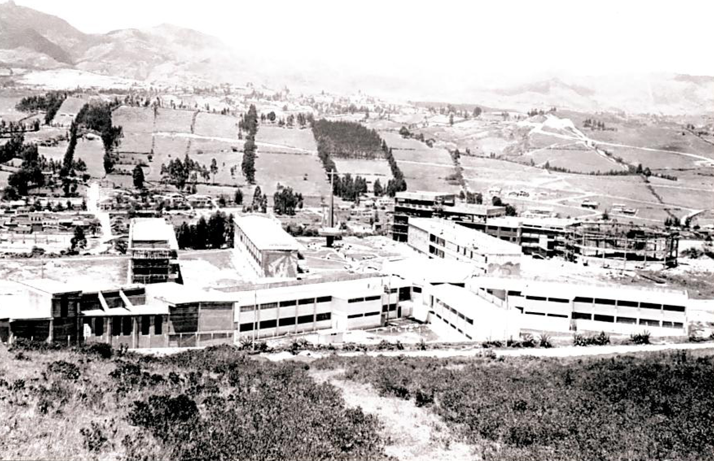
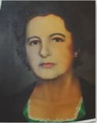
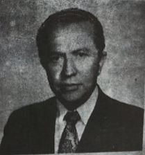
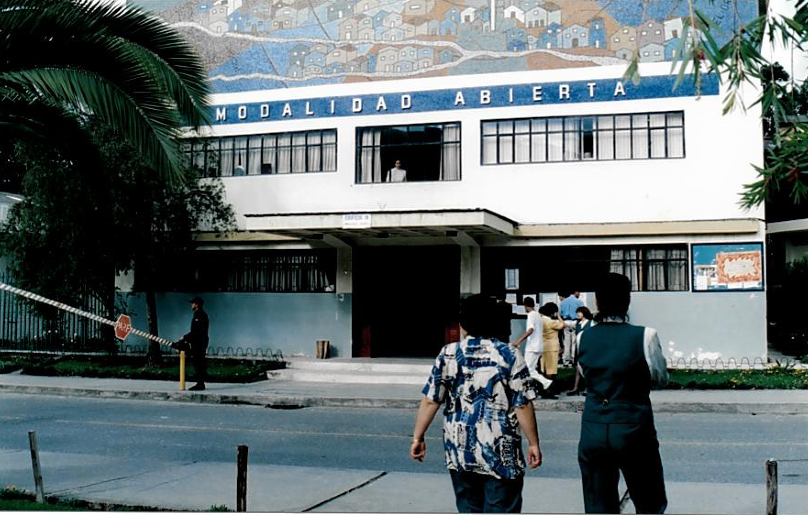

# HISTORIA



### Fundacion de la UTPL

El 3 de mayo de 1971 se funda la Universidad por la Asociación Marista Ecuatoriana (AME). El 5 de mayo se constituye como persona jurídica autónoma al amparo del convenio de Modus Vivendi celebrado entre la Santa Sede y el Ecuador, teniendo en cuenta las normas de la Iglesia en su organización y gobierno.

### 1970



Doña Virginia Riofrio, matrona de la ciudad de Loja, recordada por su gesto altamente ennoblecedor y evangélico en beneficio de la niñez y la juventud, dona los terrenos para la construcción de los edificios de la UTPL

### 1971



Primer Rector UTPL
En 1971 el Ing. Alejo Valdivieso Carrión, persona grata que procuró siempre el desarrollo y progreso de su Patria, fue el primer Rector de la UTPL.

### 1976


Creación de la Modalidad Abierta y a Distancia
La UTPL es pionera en Latinoamérica en la modalidad de educación a distancia. Inicia con la carrera de Ciencias de la Educación.


Si desea seguir conociendo de la historia visite la pagina oficial de la UTPL. [Historia](https://www.utpl.edu.ec/es/historia) .
```{tableofcontents}
```
